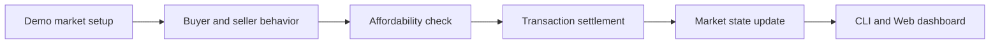

# Atlas Market Engine

> Why can a cold housing market still have hot individual listings?
>
> 为什么整体市场偏冷时，某些房子仍然会被抢？

Atlas Market Engine is a source-visible, noncommercial multi-agent real-estate market simulation demo. It turns buyers, sellers, properties, affordability checks, and transaction rules into a small runnable market so you can inspect how local market behavior emerges.

Atlas Market Engine 是一个源码可见、非商业许可公开的房地产市场多智能体仿真系统公开演示版。它把买方、卖方、房源、支付能力校验和成交规则放进一个可运行的小型市场，用来观察局部市场行为如何形成。

## 10-Second Version / 10 秒看懂

This is not a housing-price prediction tool.

It is a market-mechanism sandbox:

- buyers choose whether and what to buy;
- sellers decide whether to accept an offer;
- affordability and settlement are checked by code;
- transactions update the market state;
- the Web dashboard lets you inspect the result.

它不是房价预测工具。

它更像一个市场机制实验台：

- 买方决定是否购买、看哪套房；
- 卖方决定是否接受报价；
- 支付能力和成交交割由代码校验；
- 每笔交易会改变市场状态；
- Web 控制台可以查看运行结果。

## Why It Exists / 为什么做这个

Real-estate discussions often collapse into one number: up or down. Real markets are messier. A weak market can still contain local competition, failed negotiations, affordability walls, and uneven supply absorption.

This demo provides a small, inspectable way to explore those mechanisms without claiming to predict real prices.

关于房地产市场的讨论，经常会被压缩成一个问题：涨还是跌。但真实市场更复杂。整体偏冷的市场里，仍然可能存在局部竞争、谈判失败、支付能力约束和供给吸收差异。

这个公开演示版提供一个小而可查的实验入口，用来观察这些机制，而不是宣称预测真实价格。

## What You Can Try / 你可以马上尝试

Run the shortest check:

```bash
pip install -r requirements.txt
python scripts/public_smoke_test.py --rounds 1 --seed 42
```

Run the demo directly:

```bash
python simulation_runner.py --rounds 2 --seed 42
```

Start the Web dashboard:

```bash
python -m uvicorn api_server:app --reload
```

Open:

```text
http://127.0.0.1:8000/
```

Windows users can also run:

```powershell
powershell -ExecutionPolicy Bypass -File .\scripts\start_web_ui.ps1
```

## How The Demo Works / 演示版如何工作



Public-demo modules:

- `models.py`: data models for agents, properties, transactions, and market state.
- `property_initializer.py`: deterministic demo-market setup.
- `agent_behavior.py`: lightweight public-demo behavior selection.
- `mortgage_system.py`: affordability checks.
- `transaction_engine.py`: transaction settlement and state updates.
- `simulation_runner.py`: command-line simulation entry.
- `api_server.py`: FastAPI service and browser dashboard.
- `web/`: local dashboard page.

公开演示模块：

- `models.py`：智能体、房源、交易和市场状态的数据模型。
- `property_initializer.py`：可复现的演示市场初始化。
- `agent_behavior.py`：公开演示版行为选择。
- `mortgage_system.py`：支付能力校验。
- `transaction_engine.py`：成交交割和状态更新。
- `simulation_runner.py`：命令行运行入口。
- `api_server.py`：FastAPI 服务和浏览器控制台。
- `web/`：本地 Web 页面。

## Public Edition Scope / 公开版边界

This repository is the public demo edition of the Atlas Market Engine system. It is designed for:

- brand presence and technical review;
- teaching and noncommercial research demos;
- lightweight community discussion;
- showing the basic architecture of a market simulation.

It deliberately does not include:

- private experiment assets;
- commercial parameter packs;
- client-data adapters;
- production deployment materials;
- high-value reusable decision templates.

本仓库是 Atlas Market Engine 房地产市场多智能体仿真系统的公开演示版，适合：

- 品牌展示和技术审阅；
- 教学演示和非商业研究原型；
- 社区讨论；
- 展示市场仿真的基础架构。

本仓库有意不包含：

- 未公开实验素材；
- 商业参数包；
- 客户数据接口；
- 生产部署材料；
- 高价值可复用决策模板。

## For Readers / 适合谁看

- Developers curious about agent-based simulation.
- Researchers and students looking for a runnable market-mechanism example.
- Real-estate and urban-analysis readers who want a structured way to discuss market behavior.
- Builders who want to inspect a small Python + FastAPI demo before discussing a larger system.

- 对多智能体仿真感兴趣的开发者。
- 想找一个可运行市场机制样例的研究者和学生。
- 希望用更结构化方式讨论市场行为的房地产和城市研究读者。
- 想先审阅一个 Python + FastAPI 小型演示，再讨论更大系统的建设者。

## License / 许可证

This repository is released under the PolyForm Noncommercial License 1.0.0. See [LICENSE](LICENSE).

本仓库采用 PolyForm Noncommercial License 1.0.0。详见 [LICENSE](LICENSE)。

You may use, study, modify, and share the project for permitted noncommercial purposes under the license terms. Commercial deployment, paid service use, resale, commercial integration, or production business use requires separate written permission.

在许可证允许的非商业范围内，你可以使用、学习、修改和分享本项目。商业部署、付费服务、转售、商业集成或生产型商业使用需要另行取得书面授权。

## Attribution / 归属说明

Atlas Market Engine was inspired by CAMEL-AI OASIS-related public work and includes engineering-boundary ideas evolved from related open-source material. This repository is not an official CAMEL-AI or OASIS release.

Atlas Market Engine 受到 CAMEL-AI OASIS 相关公开工作的启发，并包含从相关开源思想演化而来的部分工程边界说明。本仓库不是 CAMEL-AI 或 OASIS 的官方发布。

Relevant files:

- [NOTICE](NOTICE)
- [ATTRIBUTION.md](ATTRIBUTION.md)
- [THIRD_PARTY_COMPONENTS.md](THIRD_PARTY_COMPONENTS.md)
- [MODIFICATION_LOG.md](MODIFICATION_LOG.md)
- [licenses/Apache-2.0.txt](licenses/Apache-2.0.txt)

## Disclaimer / 免责声明

This project is for noncommercial research, teaching, and simulation demonstration only. It is not real-estate investment advice and does not predict real market prices.

本项目仅用于非商业研究、教学和仿真实验展示，不构成房地产投资建议，也不代表对真实市场价格走势的预测。
